# BuySmart
An E-Commerce applcation developed on Flutter, which helps to run the app on Android / IOS / WindowsOS / MacOS / WebBrowser from a single codebase 
## Light Mode

<a> 
  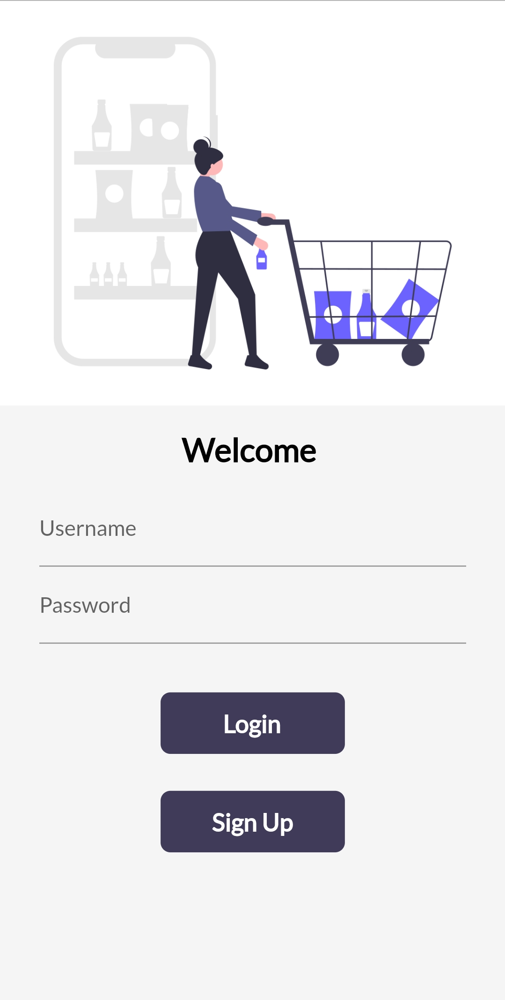<a > 
  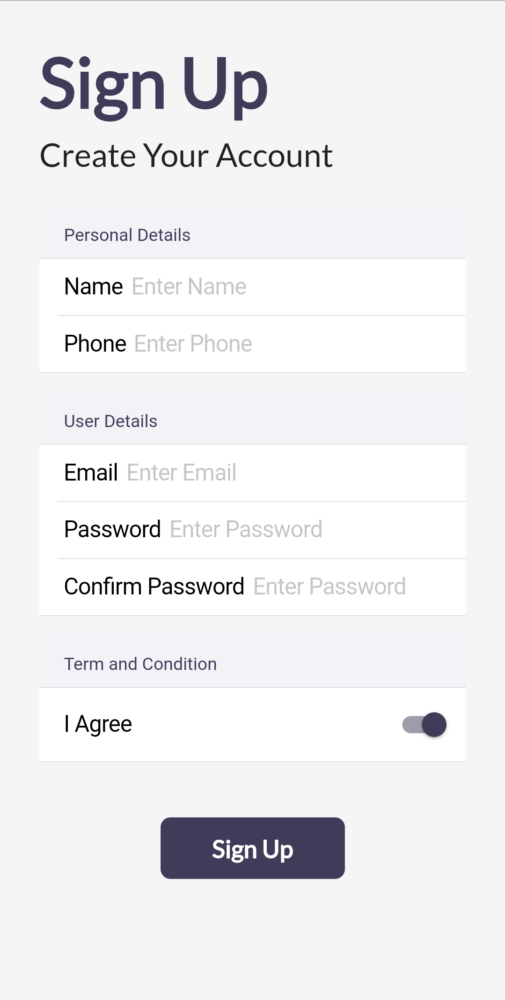</a></a>
  <a> 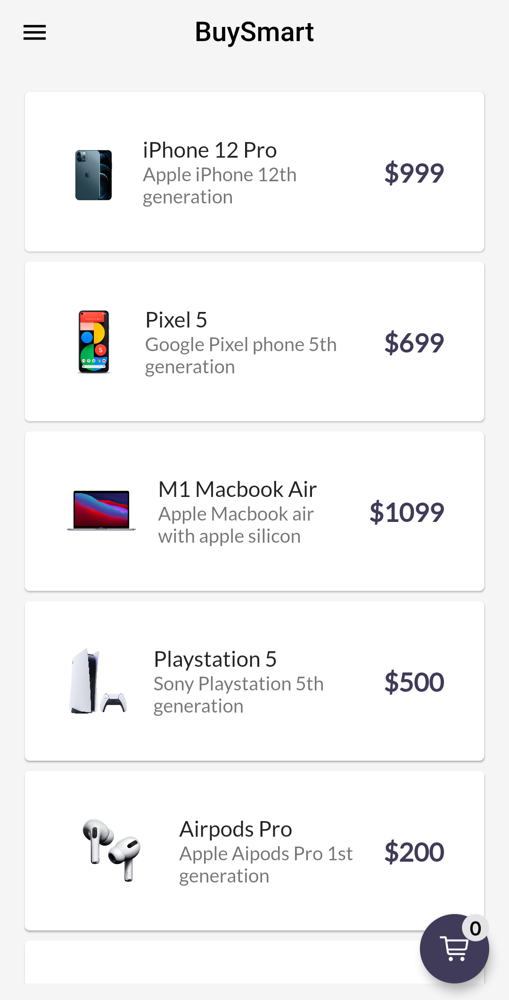</a>
  <a > 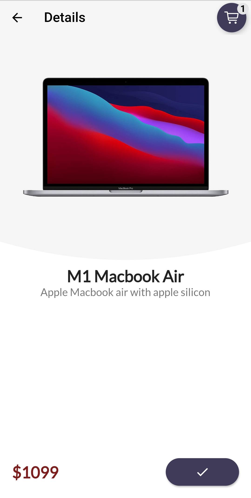</a>
  <a > 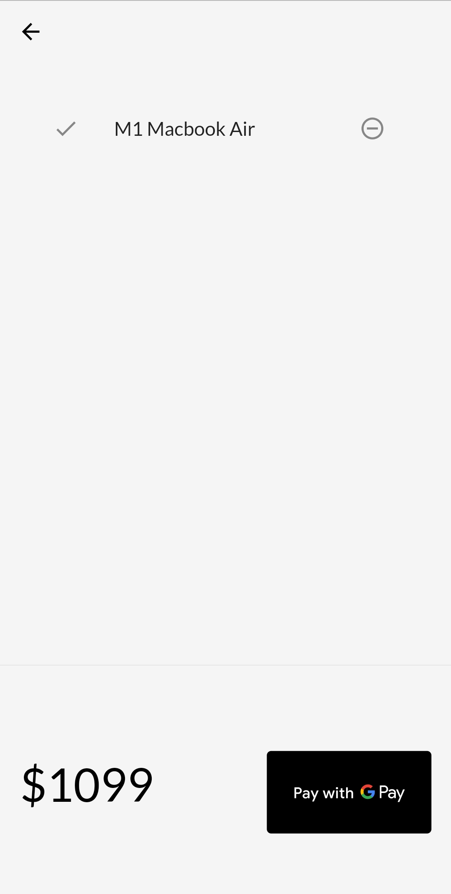</a>

## Dark Mode

<a> 
  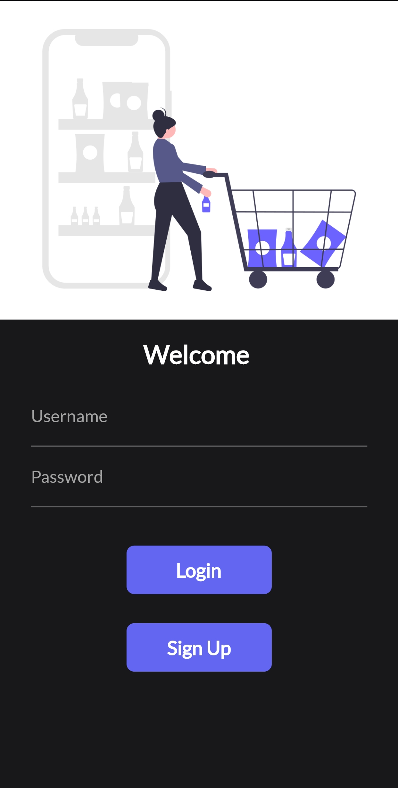<a > 
  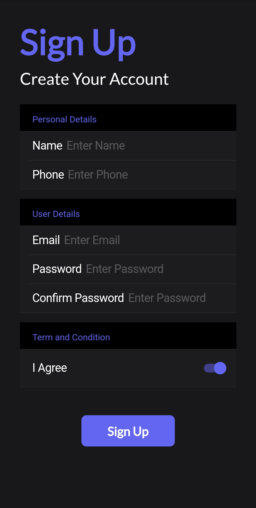</a></a>
  <a> 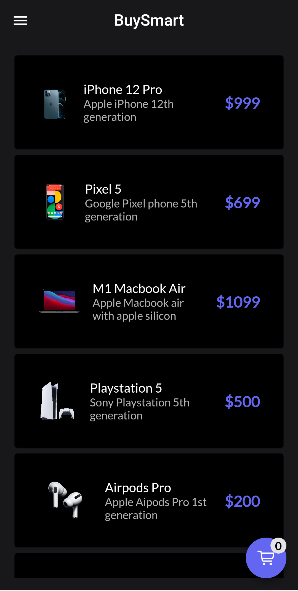</a>
  <a > 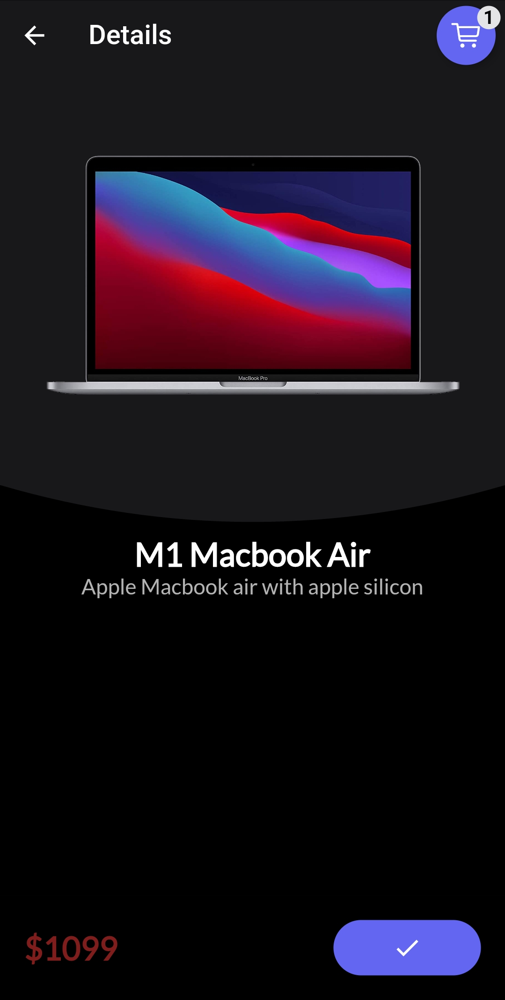</a>
  <a > 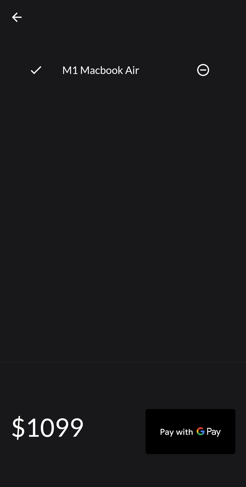</a>

## Web & Windows 

 <a > 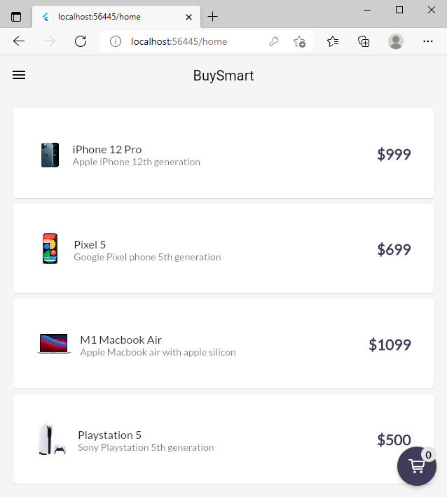 </a> |  <a > 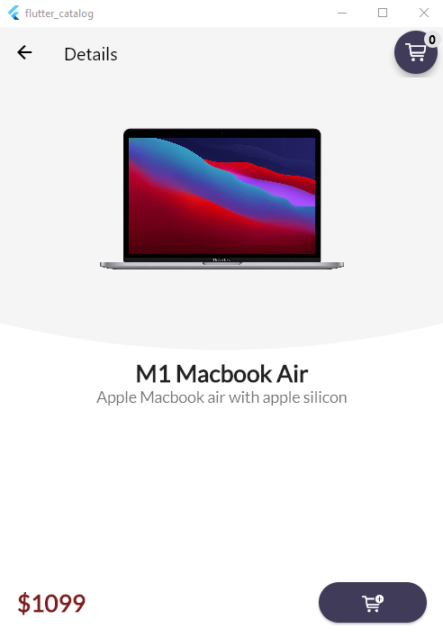</a> 

## [Download Apk File](https://drive.google.com/file/d/15S6JntTt96Wu1sHFABHAUnjlzuIncm3D/view?usp=sharing)

## Getting Started

This project is a starting point for a Flutter application.

A few resources to get you started if this is your first Flutter project:

- [Lab: Write your first Flutter app](https://flutter.dev/docs/get-started/codelab)
- [Cookbook: Useful Flutter samples](https://flutter.dev/docs/cookbook)

For help getting started with Flutter, view our
[online documentation](https://flutter.dev/docs), which offers tutorials,
samples, guidance on mobile development, and a full API reference.

## Dependencies Used
| [VelocityX](https://pub.dev/packages/velocity_x) | [Google Fonts](https://pub.dev/packages/google_fonts) | [pay](https://pub.dev/packages/pay) | [http](https://pub.dev/packages/http) |

## Project Created & Maintained By

### Sumit Kumar

Mobile App Development is my Love, Passionate #Flutter, #Android Developer

